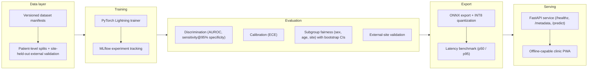

# Project Sehat — System Architecture

Project Sehat is an offline-capable clinical **decision-support** platform that
screens chest X-rays for tuberculosis (TB) and pneumonia. It is designed for
low-resource clinics: models must run on commodity hardware, degrade gracefully
without connectivity, and never present themselves as a diagnosis.

The system is a linear pipeline with hard gates between stages. A model only
moves right when it passes the evaluation criteria defined in
[roadmap.md](roadmap.md) milestone M2.



## Design principles

1. **Reproducibility before performance.** Every training run is pinned to an
   immutable, versioned data manifest and a config file; every exported model
   can be traced back to an MLflow run, a manifest hash, and a git commit.
2. **Generalization is proven, not assumed.** Splits are made at the *patient*
   level (never the image level, so films from the same patient cannot leak
   across train/validation), and one entire dataset site is held out for
   external validation. See [ethics.md](ethics.md) for why this matters
   clinically.
3. **Offline-first.** The serving path has no runtime dependency on the network,
   MLflow, or any cloud service. Everything the clinic needs ships in the
   export artifact.
4. **Decision support only.** The API returns a risk score and a calibrated
   confidence statement — never a diagnosis. This constraint shapes the API
   surface and the PWA copy.

## 1. Data layer

**Code:** `src/sehat/data/` · **Config:** `configs/data/`

- **Versioned manifests.** Datasets are described by manifest files (image
  path, label, patient ID, site, sex, age) that are content-hashed and
  versioned. Training never reads a raw dataset directory directly; it reads a
  manifest. Changing the data means producing a new manifest with a new hash,
  which becomes part of the training run's identity.
- **Patient-level splits.** All splits group by patient ID. A patient appears
  in exactly one of train/validation/test, preventing the inflated metrics that
  occur when multiple films of the same patient leak across partitions.
- **Site-held-out external validation.** For TB, one source site (e.g.
  Shenzhen or Montgomery) is excluded from training entirely and used only as
  an external test set. This measures performance under site shift — the
  failure mode that matters most when a model trained on public data meets a
  real clinic's X-ray machine.
- Data sources, licensing, and known biases are documented in
  [data_card.md](data_card.md).

## 2. Training

**Code:** `src/sehat/training/` · **Entry point:**
`python -m sehat.training.train --config configs/train/tb_baseline.yaml`

- **[PyTorch Lightning](https://lightning.ai/)** encapsulates the training
  loop, checkpointing, and hardware abstraction. The baseline config
  (`configs/train/tb_baseline.yaml`) is the reference reproducible run; every
  experiment is a diff against a checked-in config.
- **[MLflow](https://mlflow.org/)** tracks parameters, metrics, and artifacts
  for every run. The evaluation stage consumes runs by MLflow run ID, so there
  is a single source of truth linking a model to the manifest and config that
  produced it.
- Class imbalance (typical in screening datasets) is handled at the sampler /
  loss level in the config, not by duplicating data in manifests.

## 3. Evaluation

**Code:** `src/sehat/eval/` · **Outputs:** `eval_report.json` and
`eval_report.md` · **Model card renderer:** `sehat.eval.model_card`

Evaluation is a **gate**, not a report. A run that fails the gate is not
exported. Metrics are computed on the internal test split and on the
site-held-out external set:

| Metric | Why it is required |
| --- | --- |
| AUROC | Threshold-independent discrimination; the standard comparison metric for chest X-ray classifiers. |
| Sensitivity @ 95% specificity | Screening use case: fixes the false-positive budget and reports the true-positive rate actually achievable. |
| ECE (expected calibration error) | A screening score is only actionable if a "0.8" means ~80%; calibration must be measured, and any recalibration fitted on validation data only. |
| Subgroup fairness (sex, age, site) | AUROC and sensitivity are reported per subgroup with bootstrap confidence intervals; a model that only works for the majority subgroup does not ship. |
| External-site validation | The honest estimate of performance at a new clinic. Reported separately — never pooled with internal metrics. |

Results are written to `eval_report.json` (machine-readable, consumed by CI and
by the model-card renderer) and `eval_report.md` (human-readable).
`sehat.eval.model_card` renders [model_card_template.md](model_card_template.md)
into a filled model card per released model.

## 4. Export

**Code:** `src/sehat/export/` · **Benchmark:**
`python -m sehat.export.benchmark <model.onnx>`

- Models are exported to **ONNX** and quantized to **INT8** so they run at
  interactive speed on CPU-only, commodity clinic hardware without a GPU.
- Quantization is validated: the INT8 model's metrics are re-checked against
  the same evaluation gate, not assumed to match the float model.
- `sehat.export.benchmark` reports **p50 / p95 end-to-end latency** on the
  exported artifact. The latency budget for the clinic PWA is defined in the
  M3 milestone of [roadmap.md](roadmap.md).

## 5. Serving

**Code:** `src/sehat/serving/` · **Entry point:** `python -m sehat.serving`

- A **[FastAPI](https://fastapi.tiangolo.com/)** service loads the ONNX
  artifact specified by the `SEHAT_MODEL_PATH` environment variable and listens
  on `SEHAT_PORT` (default `8000`).
- Endpoints:
  - `GET /healthz` — liveness probe; returns service status without loading an
    image.
  - `GET /metadata` — model version, training manifest hash, and evaluation
    identifiers, so a clinic can always answer "which model is this?"
  - `POST /predict` — accepts a chest X-ray image and returns a risk score with
    calibration context. It never returns a diagnosis.
- **Offline-capable PWA.** The clinic frontend is a progressive web app that
  talks to the local serving instance, caches its shell for offline use, and
  requires no internet connection in the field. In offline mode, patient data
  never leaves the device — see [ethics.md](ethics.md).

## Traceability summary

A deployed prediction can be traced end to end:

```
PWA request → FastAPI (SEHAT_MODEL_PATH) → ONNX INT8 artifact
    → benchmark + eval gate results (eval_report.json)
    → MLflow run ID → training config + versioned manifest hash
    → raw public dataset versions (docs/data_card.md)
```

Every link in that chain is checked into this repository or produced by a
checked-in command. There is no manual step.
